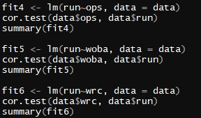
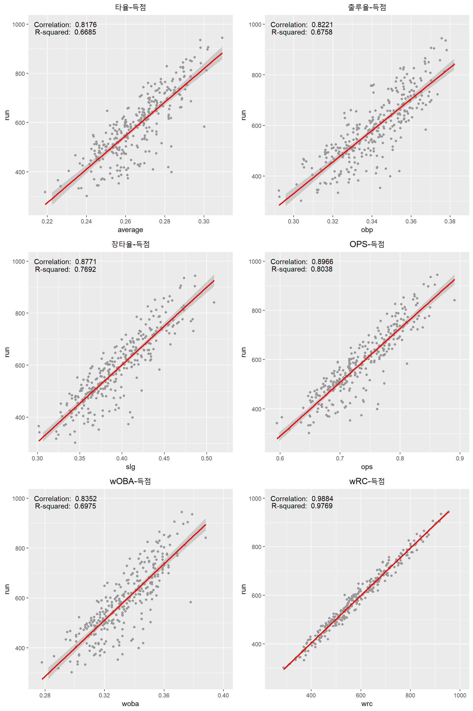
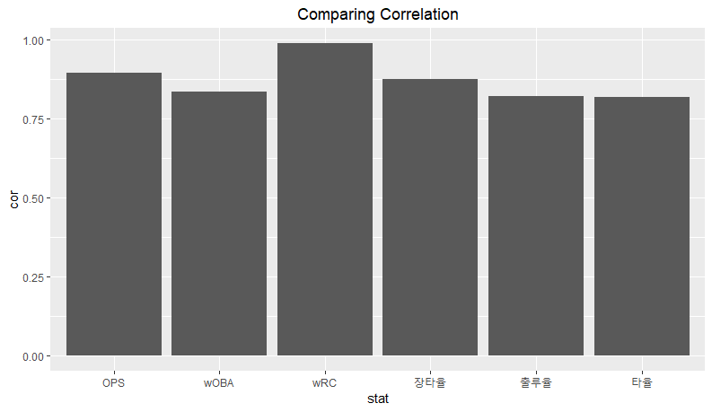
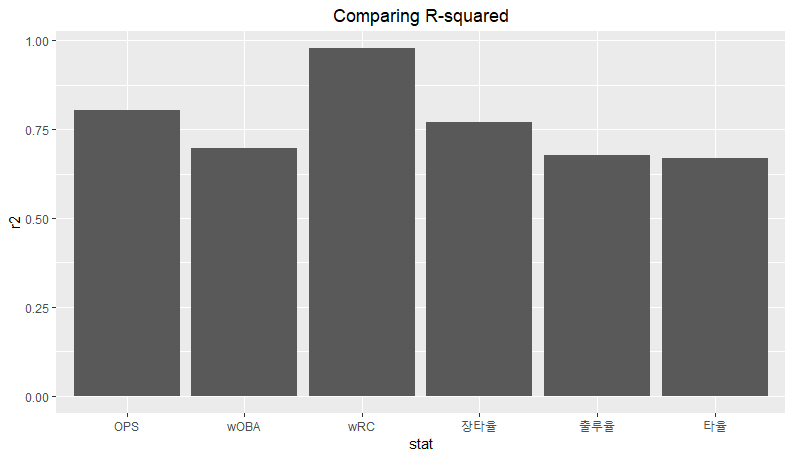
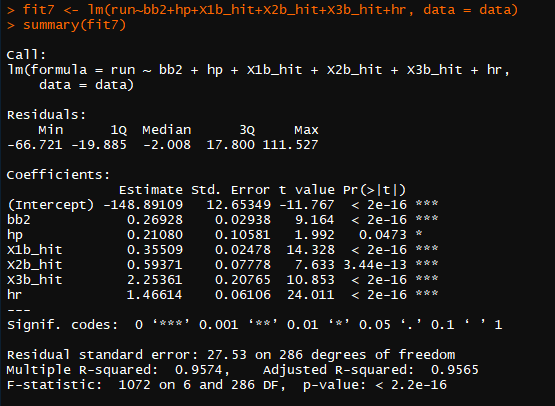

# 
야　　구 타격지표 비교분석

미디어커뮤니케이션학과

2011314240 이새몬

## 1. **연구문제**

타율이란 타자의 안타를 칠 수 있는 기회(이를 타수라고 한다) 중에서 안타를 얼마나 쳤는지를 나타낸다. 타자의 성적을 확인하는데 있어 가장 먼저 찾아보게 되는 수치이기도 하다. 그러나 타율은 타자의 성적을 정확하게 반영할 수 없다는 비판에 직면해 있는 지표이기도 하다. 그 이유는 다음과 같다.

첫번째, 타율은 볼넷의 가치를 무시한다. 타율의 계산은 &#39;안타수 / 타수&#39;로 이루어지는데, 타자가 안타를 칠 수 있는 기회를 나타내는 타수에는 타자가 볼넷을 얻어 1루로 걸어 나간 결과는 원천적으로 배제되어 있다(타수 = 타석 – 볼넷 – 사구 – 희생번트 – 희생플라이 – 수비방해 및 타격방해). 이는 볼넷으로 걸어 나갔기에 안타를 칠 수 있는 기회가 아니라고 판단했기 때문이다. 그러나 볼넷은 안타보다는 가치가 덜 할지언정 팀의 득점에 분명히 기여하기에, 볼넷의 가치를 배제한 타율은 타자의 생산력을 왜곡해 반영할 수밖에 없다. 이로 인해 타율만으로 타자를 판단할 경우 볼넷을 많이 얻어 나가는 3할타자와 그렇지 않은 3할타자의 가치가 같아지는 현상이 나타나게 된다.

두번째, 타율은 모든 안타의 가치를 똑같이 반영한다. 1루타든 2루타든 3루타든 홈런이든, 타율에서는 안타의 개수 1로 취급한다. 그러나 안타의 가치는 똑같지 않다. 1루타보다는 2루타가, 2루타보다는 3루타가, 3루타보다는 홈런이 점수를 생산할 가능성이 높다. 이처럼 엄연히 가치가 다른 각 안타들의 가치를 동일하게 취급한 타율로 타자를 평가할 경우, 장타를 많이 치지만 타율이 약간 떨어지는 타자는 단타 위주의 교타자에 비해 불리한 평가를 받게 된다.

이러한 문제를 가지고 있는 타율은 다른 여러 타격 지표와 비교했을 때 과연 어떠한 위치에 있는가? 본 연구에서는 여러 타격지표를 비교 분석해 그 중에 타율의 위치가 어디에 있는지 확인하고, 그와 동시에 타자의 생산력을 가장 정확히 반영하는 지표가 무엇인지 알아보기로 했다.

## 2. **연구설계**

 본 연구에서는 팀 타격 지표와 팀 득점 간 상관관계분석 및 회귀분석을 진행, 각각의 지표 간 결과를 비교한다. 개인 지표가 아닌 팀 지표를 사용해 분석을 진행하는 이유는, 개인 지표와는 직접적으로 상관관계를 알아볼 수 있는 생산성 지표가 없기 때문이다. 그에 반해, 팀 지표의 경우에는 팀 득점이라는 확실한 생산성 지표가 존재한다. 물론 팀 지표와 개인 지표 간 차이가 얼마나 있는지는 더 조사가 필요한 부분이다. 따라서 본 방법론을 통해 개인 지표를 평가하는데 한계가 있을 거라 판단할 수 있다. 그러나 결국 타격 지표라는 측면에서는 서로 연관성이 높다는 것을 추정할 수 있고, 타 조사에서 팀 지표 간 분석을 통해 지표의 신뢰도를 비교하는 등의 사례가 있었기 때문에 개인 지표를 분석하는 것 대신 팀 지표를 분석하는 것에 큰 무리는 없을 것이라 판단했다.

## 3. **연구대상**

 본 연구에서 비교해볼 지표는 다음과 같다.

1) 클래식 지표

    클래식 지표는 고전적으로 많이 사용되는 타율, 출루율, 장타율과 같은 비율 지표 및 홈런, 타점, 승리와 같은 누적 지표를 일컫는다. 경기에서 얻어진 수치를 바로 사용하거나 간단한 사칙연산으로 계산하는 게 특징이다. 때문에 직관적으로 이해할 수 있다는 장점이 있지만, 선수의 실력을 제대로 반영하지 못하는 게 단점으로 지적된다. 본 연구에서는 타율, 출루율, 장타율, OPS 이 네 가지 비율 지표를 비교한다.

    - (1) 타율
    
        타자가 타석에 나서, 안타를 칠 수 있는 기회 중에서 얼마나 안타를 때려냈는지를 나타내는 비율이다. 계산식은 [안타수/타수]이며 결과값은 0에서 1사이에 형성된다.

    - (2) 출루율

        타자가 전체 타석 중 얼마나 1루 이상 출루했는지 나타내는 비율이다. 이 의미처럼 안타 뿐만 아니라 볼넷이나 몸에 맞는 공과 같이 자력으로 1루에 나갈 수 있는 모든 방법을 포함한다는 것이 타율과는 다른 점이다.
        계산식은 [(안타+볼넷+몸에 맞는 공)/(타수+볼넷+몸에 맞는 공+희생플라이)]이며 결과값은 0에서 1사이에 형성된다. 볼넷의 가치를 배제하지 않기 때문에 타자의 능력을 파악할 때 타율보다 효과적일 수 있다.

    - (3) 장타율

        안타를 통해 진루한 루에 따라 차등적인 가치를 두고 비율을 계산한다. 그렇기에 같은 수의 안타를 치더라도 단타를 친 선수와 홈런을 친 선수는 같은 타율임에도 장타율에서 차이가 나게 된다.
        계산식은 [(1x1루타+2x2루타+3x3루타+4x홈런)/타수]이며 결과값은 0에서 4 사이에 형성된다. 같은 타율이라도 장타를 많이 치는 선수가 더 좋은 선수인만큼, 타율이 보여주지 못하는 타자의 실력을 보여주는 지표이다.

    - (4) OPS

        OPS는 On base Plus Slugging의 약자로, 말 그대로 출루율과 장타율을 더한 지표이다. 타자가 얼마나 자주 출루하는지에 더해 얼마나 많은 장타를 때려낼 수 있는지를 종합한 만큼, 해당 타자의 종합적인 능력을 쉽게 알 수 있다고 평가받는다. 많은 세이버메트릭스 지표가 OPS의 출루능력 + 장타능력 개념을 차용한다.
 
 
2) 세이버메트릭스 지표

    세이버메트릭스란 클래식 지표가 선수의 실력을 제대로 반영하지 못한다는 지적에 대해, 이를 보완하기 위해 나온 지표이다. 클래식 지표를 통계학적 기법으로 가공하기 때문에 클래식 지표보다 선수의 실제 능력을 객관적인 수치로 나타내는데 유리하다. 다만 그렇기에 클래식 지표와 비교해 접근성이 떨어지는 단점이 있다. 본 연구에서는 wOBA와 wRC 이 두 가지 지표를 비교한다.

    - (1) wOBA(weight On Base Average)

        탐 탱고가 선형회귀분석을 통해 고안한 세이버메트릭스 지표로, 출루율 스케일에 맞춰 타자의 생산성을 보여준다.
        기본 계산식은  [(0.72x고의사구 제외 볼넷+0.75x몸에 맞는 공+0.90x1루타+0.92x실책으로 인한 출루+1.24x2루타+1.56x3루타+1.95x홈런) / (타석-고의사구)]이며 매 시즌 가중치가 달라지는 게 특징이다. 현재는 wRC 등 더 정교화된 지표를 구하기 위해 사용되는 경우가 많다.

    - (2) wRC(weighted RC)

        wOBA를 기반으로 보다 정교화된 세이버메트릭스 지표이다. wRC와 이를 리그 평균과 비교해 상대화한 wRC+가 타자의 생산성을 측정하는 세이버메트릭스 지표 중 가장 유명하다.

## 4. **자료수집**

 연구에 사용한 자료는 야구통계사이트 STATIZ에 올라와 있는 데이터를 Python의 Selenium을 이용한 크롤링을 통해 수집했다. 1982년부터 2018년까지의 팀 지표 데이터를 수집했으며 수집 목록은 다음과 같다.

- 타석
- 타수
- 총루타수
- 총안타수/1루타/2루타/3루타/홈런
- 볼넷/몸에 맞는 공/고의사구
- 희생플라이
- 총득점
- wOBA
- wRC

클래식 지표의 경우에는 수집한 자료를 가지고 직접 계산했으며, 세이버메트릭스의 경우 계산과정이 복잡하기에 STATIZ의 데이터를 그대로 가져와 사용했다.

## 5. **알고리즘**

본 연구에서는 팀 지표와 팀 득점 간 관계를 분석하기 위해 상관관계분석과 단순회귀분석을 사용했다. 이후 활용부분에서 새 지표를 만들어 보기 위해 다중회귀분석 또한 사용했다.

## 6. **연구결과**

분석 결과 모든 지표에서 총득점 간 상관관계, 회귀분석 결과의 p값이 0.05 이하로 나타났기에 p값을 가지고 타당성을 검증하는 부분에 대한 설명은 생략한다. 각 지표의 산점도와 회귀식 그래프, 상관계수와 R-squared 값을 보면 다음과 같다. 그래프 작성에는 ggplot2 라이브러리를 사용했다(코드 부분은 분량 관계상 생략한다).

타율의 경우 상관계수 0.8176를 기록해 득점과 상당히 높은 상관관계를 보여준다. R-squared 또한 0.6685를 기록해 준수하다. 다만 유의해야 할 점은, 이 결과는 타 지표들의 결과와 비교했을 때 가장 낮은 수치라는 것이다. 상관계수의 경우 출루율이 0.8221, 장타율 0.8771, OPS 0.8966, wOBA 0.8352, wRC 0.9884로 다른 모든 지표들의 상관계수가 타율의 상관계수보다 높으며, R-squared 또한 출루율 0.6758, 장타율 0.7692, OPS 0.8038, wOBA 0.6975, wRC 0.9769로 모든 지표 중에서 타율의 결과값이 가장 낮다.

이처럼 타율은 단독으로 봤을 때는 팀 득점과 강한 상관관계를 가지고 있고, 데이터를 통해 만든 회귀식이 전체 분포에 대한 높은 설명력을 가지고 있다고 볼 수 있다. 다만, 다른 지표들과 비교할 경우 모든 지표들 중 팀 득점과 가장 낮은 상관관계를 갖고 있으며, 이를 가지고 만든 회귀식 또한 전체 데이터에 대한 설명력이 가장 낮다고 이야기할 수 있다.

다시 말해, 타율 그 자체는 생산력을 반영하고 있다. 다만 타 지표들과 비교해서 그 반영도는 높지 않으며, 타자의 생산력을 확인하기 위해서는 다른 지표를 찾아보는 편이 좋다. 지표 중에서는 세이버메트릭스 지표인 wRC가 가장 대표성이 좋고, 가볍게 확인할 수 있는 클래식 지표 중에서는 OPS가 가장 대표성이 좋다.

## 7. **활용**

본 연구에서 사용한 wOBA의 경우 세이버메트릭스 지표임에도 불구하고, 상관계수와 R-squared가 클래식 지표와 비교했을 때 거의 차이 나지 않는다. 이는 wOBA의 기본 계산식을 이용해 수치를 계산했기 때문이다. 실제 쓰이는 wOBA의 경우 매 시즌 가중치를 다시 산정하기에 계산식의 수치가 매번 달라지는 특징이 있다. 본 연구에서는 이 점에 착안해, wOBA의 계산식에 사용한 지표들을 가지고 다중회귀분석을 통한 회귀식을 만들어 보기로 했다.

이를 위해 작성한 R 코드는 다음과 같다.

첫번째로 wOBA의 계산식에 있는 &#39;고의사구를 제외한 볼넷&#39; 데이터를 만들었다. 전체 볼넷 데이터(bb)와 고의사구 데이터(ibb)를 가지고 있었기 때문에 전체 볼넷에서 고의사구 수를 뺀 데이터를 만들었다.

두번째로는 다중회귀분석 모델을 만들었다. 이때 사용한 인수는 [고의사구 제외 볼넷, 몸에 맞는 공, 1루타, 2루타, 3루타, 홈런]으로, 원래 wOBA에는 실책으로 인한 출루가 인수로 들어가지만 부득이하게 제외했다. 해당 데이터는 STATIZ에서 2013년 데이터부터 제공하기에 모든 년도의 데이터를 대상으로 하는 해당 연구에서는 사용할 수 없었기 때문이다.

마지막으로 해당 모델을 요약한 결과는 다음과 같았다.

모든 인수의 p값이 0.05 이하로 타당성 여부를 충족하며, R-squared 또한 0.9574로 상당히 높은 값을 보여주었다. 이를 바탕으로 wOBA와 같이 소수점 두자리까지 반올림하여 다음과 같은 회귀식을 작성했다.

[0.27x고의사구 제외 볼넷+0.21x몸에 맞는 공+0.36x1루타+0.59x2루타+2.25x3루타+1.47x홈런]

## 8. **한계**

   1) 본 연구의 한계 및 보완점

        연구설계 부분에서 언급했듯, 본 연구의 한계는 팀 득점이라는 생산성 지표와의 직접 비교를 위해 팀 타격 지표를 활용했다는 점이다. 문제는, 같은 타격 결과로 만든 지표이기에 어느정도는 대입이 가능하지만, 팀의 모든 구성원들이 만들어낸 지표의 종합인 팀 지표와 구성원 개개인 간의 지표가 완전히 같은 선상에 있다고 보장할 수가 없다는 점이다. 이를 해결하기 위한 방법으로는 크게 두 가지가 있다.

        첫번째, 이를 보완해 개인 지표를 가지고 타격 지표의 생산성 반영 여부를 따지기 위해서는 더 세부적인 기록 분석이 필요하다. 본 연구에서 분석한 기록은 플레이의 최종 결과를 집계한 것들이다. 그러나 wOBA와 같은 지표의 경우 계산하는데 있어 더 세밀한 기록, 즉 경기의 상황을 더 세부적으로 기록한 데이터를 요구한다. Play-by-play라 불리는 이 데이터는 경기의 흐름을 기록하기에 상황별 기록을 살펴보는 것이 가능하다(물론 모든 세이버메트릭스 지표가 이러한 play-by-play 데이터를 요구하는 것은 아니며, 어떤 세이버메트릭스 지표는 본 연구에서 사용한 종류의 지표들만 가지고도 높은 신뢰도를 보이기도 한다). 이처럼 다양한 지표를 다양한 시각, 방법론으로 분석해볼 필요가 있다.

        두번째, 팀 지표가 개인 지표까지 대표할 수 있는지에 대한 연구가 필요하다. 팀 득점과 지표 간 관계 분석은 본 연구 뿐만 아니라 다른 세이버메트리션의 연구에서도 종종 찾아볼 수 있다. 본 연구 뿐만 아니라 타 연구에서도 팀 지표를 생산성 비교에 사용하는 것을 보면 분명 그에 대한 논리적 기반이 존재하고 있을 것이다. 이를 확인하고 설명해 설득력을 높이는 작업이 필요하다.

 

2) 활용 파트의 한계 및 보완점

    활용 파트에서 진행한 다중 회귀분석의 한계 및 보완점은 크게 두 가지로 이야기할 수 있다.

    첫번째, 다중공선성 검사 결과 수치가 높다. 해당 모델을 다중공선성 검사 함수로 검사한 결과 기준점인 10을 뛰어 넘는 23.48968을 기록했다. 각 인수들이 서로에게 미치는 영향력이 크다는 증거다. 따라서 심화된 분석기법(ex. 구조방정식) 등, 이를 완화할 방법을 모색해야 한다.

    두번째, 상식적으로 생각했을 땐 홈런의 가치가 1루타, 2루타, 3루타의 가치보다 커야 한다. 그러나 활용 파트에서 만든 회귀식의 경우 3루타의 가중치가 2.25, 홈런의 가중치가 1.47로 3루타의 가치가 홈런의 가치보다 크게 책정되어 있다. 이는 기존의 상식을 뒤엎고 3루타가 홈런보다 가치가 크다는 것을 증명했다고 볼 수도 있지만, 역시 그보다는 회귀모델의 제작 과정에서 무엇인가 부족한 점이 있다는 것을 보여준다는 점이 크다. 이러한 점은 앞서 말했듯이 더 심화된 분석기법을 이용하거나, 더 세밀한 데이터를 분석하는 것으로 정확한 가중치를 찾아내 보완할 수 있을 것이라 생각한다.