세팅
----

``` r
library(ggplot2)
```

    ## Warning: package 'ggplot2' was built under R version 3.5.3

``` r
library(gridExtra)
```

    ## Warning: package 'gridExtra' was built under R version 3.5.3

``` r
data <- read.csv("C:/Users/toahs/OneDrive/Documents/team_stat.csv")
```

ggplot2 라이브러리 설치 및 크롤링한 csv파일을 불러온다.

I. 클래식 지표
==============

클래식 지표란 전통적으로 사용하던 누적/비율 지표를 일컫는다.

경기에서 얻어진 수치를 바로 사용하거나 간단한 사칙연산으로 계산하는 게 특징이다.

직관적이기에 이해하기 쉽다는 장점이 있지만, 반면에 선수의 실력을 제대로 반영하지 못하는 게 단점으로 지적된다.

1. 타율-득점 분석
-----------------

타율은 타자가 타석에 나서, 안타를 칠 수 있는 기회 중에서 얼마나 안타를 때려냈는지를 나타내는 비율이다.

계산식은 안타수/타수.

일반적으로 타자의 실력이 어떤지 볼 때 가장 먼저 확인하게 되는 수치이다.

### 1-1. 산포도 그래프 작성

분석을 진행하기에 앞서 산포도 그래프를 작성해 전체적인 모양을 파악한다.

``` r
plot(x = data$average, y = data$run, main = "타율-득점", xlab = "타율", ylab = "득점", col = "blueviolet")
```

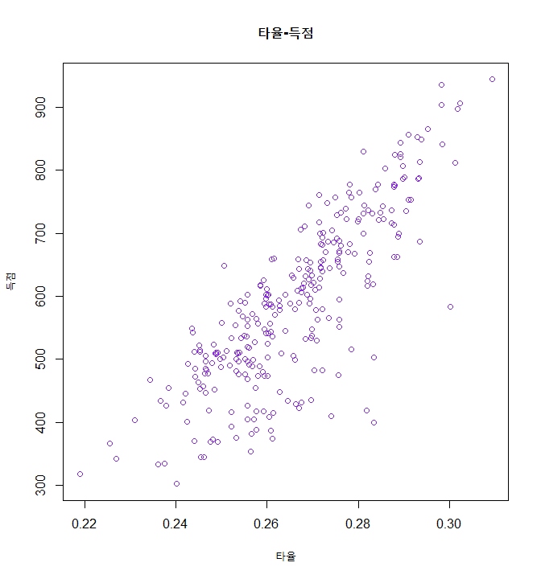

### 1-2. 상관관계 분석

불러온 데이터시트를 토대로 타율과 득점 간 상관관계를 분석한다.

``` r
cor.test(data$average, data$run)
```

    ## 
    ##  Pearson's product-moment correlation
    ## 
    ## data:  data$average and data$run
    ## t = 24.223, df = 291, p-value < 2.2e-16
    ## alternative hypothesis: true correlation is not equal to 0
    ## 95 percent confidence interval:
    ##  0.7756906 0.8523397
    ## sample estimates:
    ##       cor 
    ## 0.8176057

p값은 살펴볼 것도 없이 매우 작아, 타율과 득점 간 상관관계가 있다는 연구가설이 성립한다 (앞으로의 p값은 모두 매우 작으므로 p값에 대한 설명은 생략한다).

상관계수 또한 0.8176057로 높은 편이다.

### 1-3. 회귀분석

타율을 독립변수로, 득점을 종속변수로 하여 회귀분석을 실시한다.

``` r
fit1 <- lm(run~average, data = data)
summary(fit1)
```

    ## 
    ## Call:
    ## lm(formula = run ~ average, data = data)
    ## 
    ## Residuals:
    ##     Min      1Q  Median      3Q     Max 
    ## -307.92  -38.74   16.72   50.43  164.76 
    ## 
    ## Coefficients:
    ##             Estimate Std. Error t value Pr(>|t|)    
    ## (Intercept) -1223.06      74.89  -16.33   <2e-16 ***
    ## average      6809.50     281.11   24.22   <2e-16 ***
    ## ---
    ## Signif. codes:  0 '***' 0.001 '**' 0.01 '*' 0.05 '.' 0.1 ' ' 1
    ## 
    ## Residual standard error: 76.17 on 291 degrees of freedom
    ## Multiple R-squared:  0.6685, Adjusted R-squared:  0.6673 
    ## F-statistic: 586.8 on 1 and 291 DF,  p-value: < 2.2e-16

기울기와 절편 모두 p값이 매우 작아, 회귀식의 신뢰도는 높다.

그러나 R-squared는 0.6685로 그렇게 높은 편은 아니다.

### 1-4. ggplot2를 통해 그래프 그려보기

``` r
graph1 <- ggplot2::ggplot(data = data, aes(x = average, y = run)) +
  geom_point(colour = "gray60") +
  ggtitle("타율-득점") +
  theme(plot.title = element_text(hjust = 0.5)) +
  stat_smooth(method = lm, colour = "red") +
  xlim(c(0.215, 0.31)) +
  ylim(c(260, 1000)) +
  annotate("text", x = 0.215+0.15*(0.31-0.215), y = 1000, label = paste("Correlation: ", round(cor(data$average, data$run), 4))) +
  annotate("text", x = 0.215+0.15*(0.31-0.215), y = 0.97*1000, label = paste("R-squared: ", round(as.numeric(summary(fit1)[8]), 4)))
graph1
```

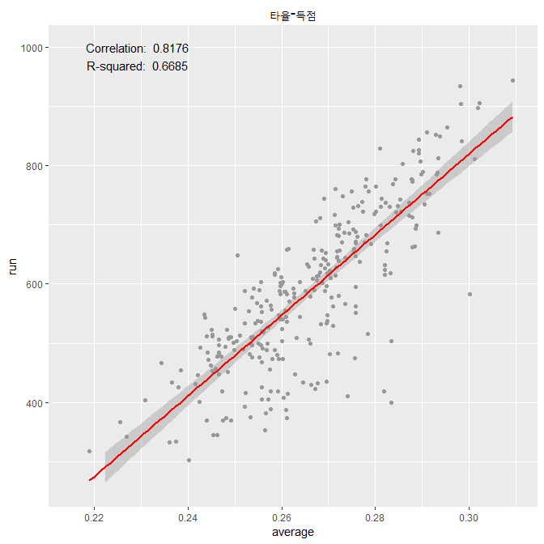

2. 출루율-득점 분석
-------------------

출루율은 타자가 전체 타석 중 얼마나 1루 이상 출루했는지 나타내는 비율이다.

이 의미처럼 안타 뿐만 아니라 볼넷이나 몸에 맞는 공과 같이 자력으로 1루에 나갈 수 있는 모든 방법을 포함한다.

계산식은 (안타+볼넷+몸에 맞는 공)/(타수+볼넷+몸에 맞는 공+희생플라이).

1루로 가는 짧은 안타(단타)나 볼넷이나 1루에 나가는 건 똑같기 때문에, 타자의 능력을 파악할 때 타율보다 효과적일 수 있다.

### 2-1. 산포도 그래프 작성

``` r
plot(x = data$obp, y = data$run, main = "출루율-득점", xlab = "출루율", ylab = "득점", col = "blueviolet")
```

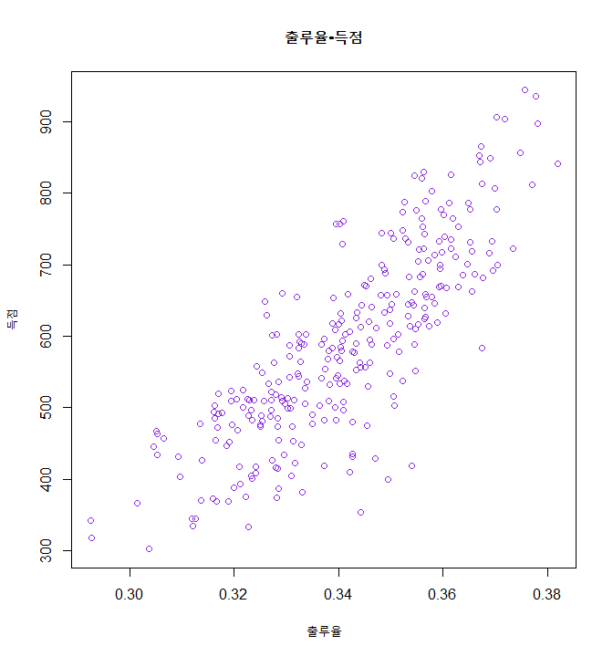

### 2-2. 상관관계 분석

출루율과 득점 간의 상관관계를 분석한다.

``` r
cor.test(data$obp, data$run)
```

    ## 
    ##  Pearson's product-moment correlation
    ## 
    ## data:  data$obp and data$run
    ## t = 24.63, df = 291, p-value < 2.2e-16
    ## alternative hypothesis: true correlation is not equal to 0
    ## 95 percent confidence interval:
    ##  0.7810629 0.8560251
    ## sample estimates:
    ##       cor 
    ## 0.8220747

상관계수는 0.8220747으로 타율-득점보다 높다.

### 2-3. 회귀분석

출루율을 독립변수로, 득점을 종속변수로 하여 회귀분석을 실시한다.

``` r
fit2 <- lm(run~obp, data = data)
summary(fit2)
```

    ## 
    ## Call:
    ## lm(formula = run ~ obp, data = data)
    ## 
    ## Residuals:
    ##      Min       1Q   Median       3Q      Max 
    ## -253.692  -51.555    1.992   52.525  179.729 
    ## 
    ## Coefficients:
    ##             Estimate Std. Error t value Pr(>|t|)    
    ## (Intercept) -1535.64      86.33  -17.79   <2e-16 ***
    ## obp          6223.07     252.67   24.63   <2e-16 ***
    ## ---
    ## Signif. codes:  0 '***' 0.001 '**' 0.01 '*' 0.05 '.' 0.1 ' ' 1
    ## 
    ## Residual standard error: 75.32 on 291 degrees of freedom
    ## Multiple R-squared:  0.6758, Adjusted R-squared:  0.6747 
    ## F-statistic: 606.6 on 1 and 291 DF,  p-value: < 2.2e-16

R-squared는 0.6758로 타율-득점보다 살짝 높아졌다.

그럼에도 불구하고 그렇게 높은 편은 아니다.

### 2-4. ggplot2를 통해 그래프 그려보기

``` r
graph2 <- ggplot2::ggplot(data = data, aes(x = obp, y = run)) +
  geom_point(colour = "gray60") +
  ggtitle("출루율-득점") +
  theme(plot.title = element_text(hjust = 0.5)) +
  stat_smooth(method = lm, colour = "red") +
  xlim(c(0.29, 0.385)) +
  ylim(c(280, 1000)) +
  annotate("text", x = 0.29+0.15*(0.385-0.29), y = 1000, label = paste("Correlation: ", round(cor(data$obp, data$run), 4))) +
  annotate("text", x = 0.29+0.15*(0.385-0.29), y = 0.97*1000, label = paste("R-squared: ", round(as.numeric(summary(fit2)[8]), 4)))
graph2
```

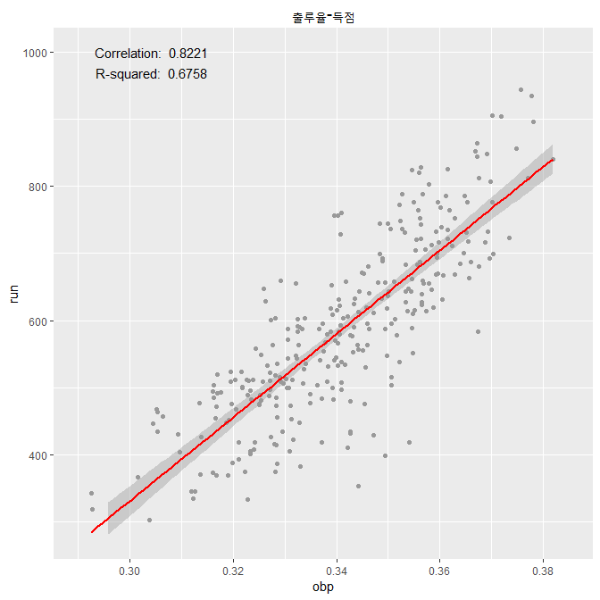

3. 장타율-득점 분석
-------------------

장타율은 안타를 통해 진루한 루에 따라 차등적인 가치를 두고 비율을 계산한다.

그렇기에 똑같은 안타를 치더라도 단타를 친 선수와 홈런을 친 선수는 타율은 같을지 몰라도 장타율에서 차이가 난다.

계산식은 (1x1루타 + 2x2루타 + 3x3루타 + 4x홈런)/타수.

같은 타율이라도 장타를 많이 치는 선수가 더 좋은 선수인 만큼, 타율이 보여주지 못하는 타자의 실력을 보여주는 수치이다.

### 3-1. 산포도 그래프 작성

``` r
plot(x = data$slg, y = data$run, main = "장타율-득점", xlab = "장타율", ylab = "득점", col = "blueviolet")
```

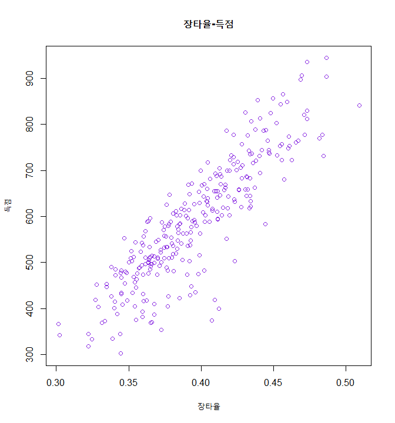

### 3-2. 상관관계 분석

장타율과 득점 간 상관관계를 분석한다.

``` r
cor.test(data$slg, data$run)
```

    ## 
    ##  Pearson's product-moment correlation
    ## 
    ## data:  data$slg and data$run
    ## t = 31.146, df = 291, p-value < 2.2e-16
    ## alternative hypothesis: true correlation is not equal to 0
    ## 95 percent confidence interval:
    ##  0.8476658 0.9010901
    ## sample estimates:
    ##       cor 
    ## 0.8770625

상관계수는 0.8770625으로 출루율-득점보다 높다.

### 3-3. 회귀분석

장타율을 독립변수로, 득점을 종속변수로 하여 회귀분석을 실시한다.

``` r
fit3 <- lm(run~slg, data = data)
summary(fit3)
```

    ## 
    ## Call:
    ## lm(formula = run ~ slg, data = data)
    ## 
    ## Residuals:
    ##      Min       1Q   Median       3Q      Max 
    ## -250.568  -31.977    5.772   43.914  134.306 
    ## 
    ## Coefficients:
    ##             Estimate Std. Error t value Pr(>|t|)    
    ## (Intercept)  -586.60      37.89  -15.48   <2e-16 ***
    ## slg          2972.15      95.43   31.15   <2e-16 ***
    ## ---
    ## Signif. codes:  0 '***' 0.001 '**' 0.01 '*' 0.05 '.' 0.1 ' ' 1
    ## 
    ## Residual standard error: 63.55 on 291 degrees of freedom
    ## Multiple R-squared:  0.7692, Adjusted R-squared:  0.7684 
    ## F-statistic:   970 on 1 and 291 DF,  p-value: < 2.2e-16

R-squared는 0.7692로 타율-득점, 출루율-득점에 비해 준수하다.

### 3-4. ggplot2를 통해 그래프 그려보기

``` r
graph3 <- ggplot2::ggplot(data = data, aes(x = slg, y = run)) +
  geom_point(colour = "gray60") +
  ggtitle("장타율-득점") +
  theme(plot.title = element_text(hjust = 0.5)) +
  stat_smooth(method = lm, colour = "red") +
  xlim(c(0.3, 0.52)) +
  ylim(c(300, 1000)) +
  annotate("text", x = 0.3+0.15*(0.52-0.3), y = 1000, label = paste("Correlation: ", round(cor(data$slg, data$run), 4))) +
  annotate("text", x = 0.3+0.15*(0.52-0.3), y = 0.97*1000, label = paste("R-squared: ", round(as.numeric(summary(fit3)[8]), 4)))
graph3
```

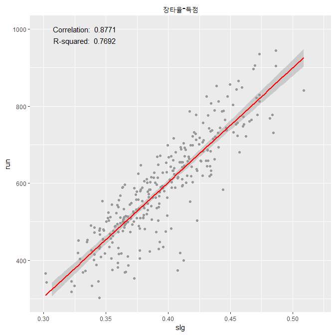

4. OPS-득점 분석
----------------

OPS(On base Plus Slugging)는 출루율과 장타율을 더한 수치이다.

타자가 얼마나 자주 출루하는지에 더해 얼마나 많은 장타를 때려낼 수 있는지를 종합한 만큼, 해당 타자의 종합적인 능력을 쉽게 알 수 있다고 평가받는다.

### 4-1. 산포도 그래프 작성

``` r
plot(x = data$ops, y = data$run, main = "OPS-득점", xlab = "OPS", ylab = "득점", col = "blueviolet")
```

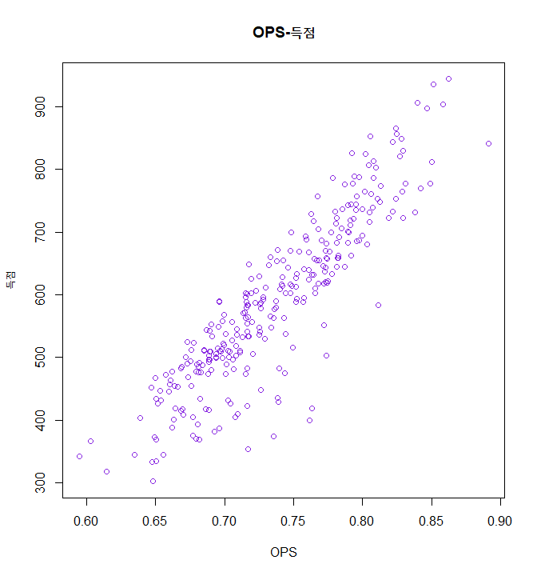

### 4-2. 상관관계 분석

OPS와 득점 간 상관관계를 분석한다.

``` r
cor.test(data$ops, data$run)
```

    ## 
    ##  Pearson's product-moment correlation
    ## 
    ## data:  data$ops and data$run
    ## t = 34.532, df = 291, p-value < 2.2e-16
    ## alternative hypothesis: true correlation is not equal to 0
    ## 95 percent confidence interval:
    ##  0.8715166 0.9169523
    ## sample estimates:
    ##       cor 
    ## 0.8965684

상관계수는 0.8965684로 장타율-득점보다 약간 높다.

### 4-3. 회귀분석

OPS를 독립변수로, 득점을 종속변수로 하여 회귀분석을 실시한다.

``` r
fit4 <- lm(run~ops, data = data)
summary(fit4)
```

    ## 
    ## Call:
    ## lm(formula = run ~ ops, data = data)
    ## 
    ## Residuals:
    ##      Min       1Q   Median       3Q      Max 
    ## -244.428  -27.310    7.106   38.178  116.204 
    ## 
    ## Coefficients:
    ##             Estimate Std. Error t value Pr(>|t|)    
    ## (Intercept) -1023.22      46.78  -21.87   <2e-16 ***
    ## ops          2187.83      63.36   34.53   <2e-16 ***
    ## ---
    ## Signif. codes:  0 '***' 0.001 '**' 0.01 '*' 0.05 '.' 0.1 ' ' 1
    ## 
    ## Residual standard error: 58.59 on 291 degrees of freedom
    ## Multiple R-squared:  0.8038, Adjusted R-squared:  0.8032 
    ## F-statistic:  1192 on 1 and 291 DF,  p-value: < 2.2e-16

R-squared는 0.8038으로 앞선 타 수치들보다 높다.

### 4-4. ggplot2를 통해 그래프 그려보기

``` r
graph4 <- ggplot2::ggplot(data = data, aes(x = ops, y = run)) +
  geom_point(colour = "gray60") +
  ggtitle("OPS-득점") +
  theme(plot.title = element_text(hjust = 0.5)) +
  stat_smooth(method = lm, colour = "red") +
  xlim(c(0.59, 0.9)) +
  ylim(c(260, 1000)) +
  annotate("text", x = 0.59+0.15*(0.9-0.59), y = 1000, label = paste("Correlation: ", round(cor(data$ops, data$run), 4))) +
  annotate("text", x = 0.59+0.15*(0.9-0.59), y = 0.97*1000, label = paste("R-squared: ", round(as.numeric(summary(fit4)[8]), 4)))
graph4
```

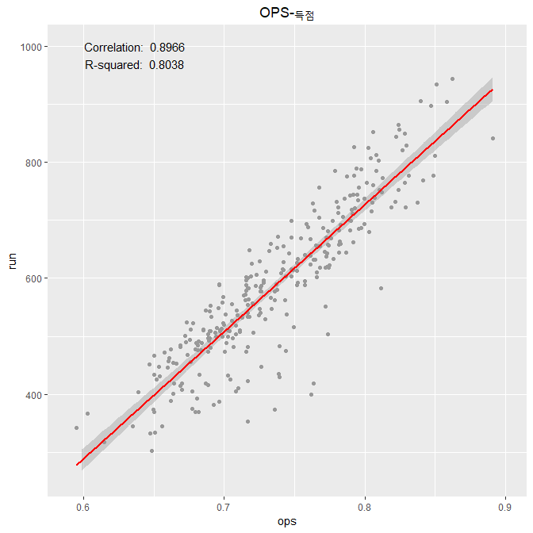

II. 세이버메트릭스
==================

세이버메트릭스란 클래식 지표가 선수의 실력을 제대로 반영하지 못한다는 지적에 대해 이를 보완하기 위해 나온 지표이다.

클래식 지표를 통계학적 기법으로 가공하기 때문에 클래식 지표보다 선수의 실제 능력을 객관적인 수치로 나타내는데 유리하다.

다만 그렇기에 클래식 지표와 비교해 접근성이 떨어지는 단점이 있다.

5. wOBA-득점 분석
-----------------

wOBA(weight On Base Average)는 탐 탱고가 선형회귀분석을 통해 고안한 세이버메트릭스 지표로, 출루율 스케일에 맞춰 타자의 생산성을 보여준다.

계산식은 (0.72x고의사구 제외 볼넷 + 0.75x몸에 맞는 공 + 0.90x1루타 + 0.92x실책으로 인한 출루 + 1.24x2루타 + 1.56x3루타 + 1.95x홈런) / (타석 - 고의사구).

현재에는 그대로 사용하기보다는 이를 이용해 더 정교화된 수치를 구하기 위해 사용한다.

### 5-1. 산포도 그래프 작성

``` r
plot(x = data$woba, y = data$run, main = "wOBA-득점", xlab = "wOBA", ylab = "득점", col = "blueviolet")
```

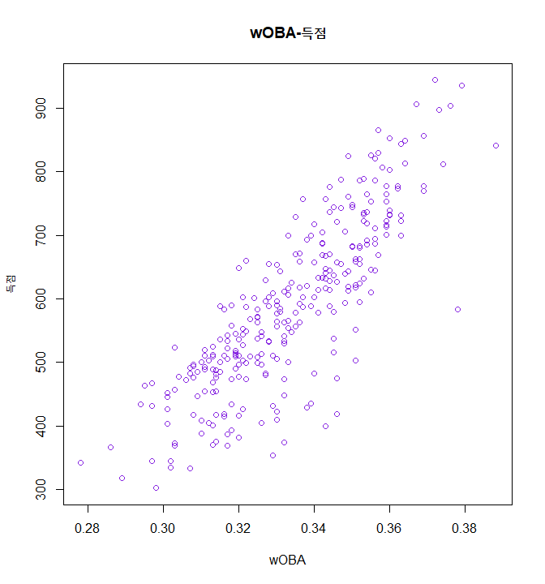

### 5-2. 상관관계 분석

wOBA와 득점 간 상관관계를 분석한다.

``` r
cor.test(data$woba, data$run)
```

    ## 
    ##  Pearson's product-moment correlation
    ## 
    ## data:  data$woba and data$run
    ## t = 25.904, df = 291, p-value < 2.2e-16
    ## alternative hypothesis: true correlation is not equal to 0
    ## 95 percent confidence interval:
    ##  0.7968441 0.8668070
    ## sample estimates:
    ##       cor 
    ## 0.8351733

상관계수는 0.8351733로 OPS보다 낮다.

### 5-3. 회귀분석

wOBA를 독립변수로, 득점을 종속변수로 하여 회귀분석을 실시한다.

``` r
fit5 <- lm(run~woba, data = data)
summary(fit5)
```

    ## 
    ## Call:
    ## lm(formula = run ~ woba, data = data)
    ## 
    ## Residuals:
    ##      Min       1Q   Median       3Q      Max 
    ## -255.564  -36.767    1.688   46.770  149.981 
    ## 
    ## Coefficients:
    ##             Estimate Std. Error t value Pr(>|t|)    
    ## (Intercept) -1293.15      72.74  -17.78   <2e-16 ***
    ## woba         5639.46     217.70   25.90   <2e-16 ***
    ## ---
    ## Signif. codes:  0 '***' 0.001 '**' 0.01 '*' 0.05 '.' 0.1 ' ' 1
    ## 
    ## Residual standard error: 72.76 on 291 degrees of freedom
    ## Multiple R-squared:  0.6975, Adjusted R-squared:  0.6965 
    ## F-statistic:   671 on 1 and 291 DF,  p-value: < 2.2e-16

R-squared는 0.6975로 OPS, 장타율보다 낮으며 출루율과 비슷하다.

### 5-4. ggplot2를 통해 그래프 그려보기

``` r
graph5 <- ggplot2::ggplot(data = data, aes(x = woba, y = run)) +
  geom_point(colour = "gray60") +
  ggtitle("wOBA-득점") +
  theme(plot.title = element_text(hjust = 0.5)) +
  stat_smooth(method = lm, colour = "red") +
  xlim(c(0.275, 0.4)) +
  ylim(c(270, 1000)) +
  annotate("text", x = 0.275+0.15*(0.4-0.275), y = 1000, label = paste("Correlation: ", round(cor(data$woba, data$run), 4))) +
  annotate("text", x = 0.275+0.15*(0.4-0.275), y = 0.97*1000, label = paste("R-squared: ", round(as.numeric(summary(fit5)[8]), 4)))
graph5
```

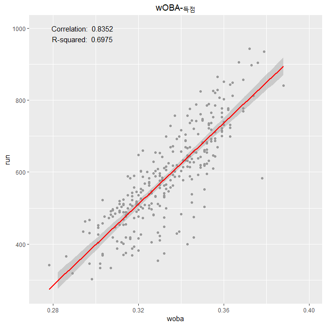

6. wRC-득점 분석
----------------

wRC(weighted RC)는 wOBA를 기반으로 보다 정교화된 세이버메트릭스 지표이다.

wRC와 이를 리그 평균과 비교해 상대화한 wRC+가 타자의 생산성을 측정하는 세이버메트릭스 지표 중 가장 유명하다.

### 6-1. 산포도 그래프 작성

``` r
plot(x = data$wrc, data$run, main = "wRC-득점", xlab = "wRC", ylab = "득점", col = "blueviolet")
```

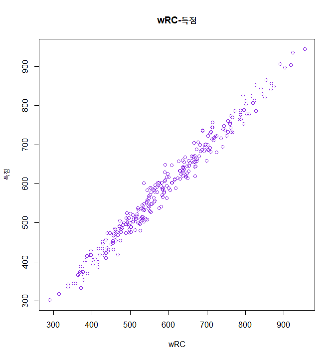

앞서 다른 지표와 달리 육안으로도 분포가 상당한 선형을 이루고 있음을 알 수 있다.

### 6-2. 상관관계 분석

wRC와 득점 간 상관관계를 분석한다.

``` r
cor.test(data$wrc, data$run)
```

    ## 
    ##  Pearson's product-moment correlation
    ## 
    ## data:  data$wrc and data$run
    ## t = 111.02, df = 291, p-value < 2.2e-16
    ## alternative hypothesis: true correlation is not equal to 0
    ## 95 percent confidence interval:
    ##  0.9854206 0.9907749
    ## sample estimates:
    ##       cor 
    ## 0.9884009

상관계수는 0.9884009로 1에 근접하는 수준이다.

### 6-3. 회귀분석

wRC를 독립변수로, 득점을 종속변수로 하여 회귀분석을 실시한다.

``` r
fit6 <- lm(run~wrc, data = data)
summary(fit6)
```

    ## 
    ## Call:
    ## lm(formula = run ~ wrc, data = data)
    ## 
    ## Residuals:
    ##     Min      1Q  Median      3Q     Max 
    ## -50.410 -13.468  -0.841  13.940  65.548 
    ## 
    ## Coefficients:
    ##             Estimate Std. Error t value Pr(>|t|)    
    ## (Intercept)  13.2688     5.3060   2.501   0.0129 *  
    ## wrc           0.9770     0.0088 111.024   <2e-16 ***
    ## ---
    ## Signif. codes:  0 '***' 0.001 '**' 0.01 '*' 0.05 '.' 0.1 ' ' 1
    ## 
    ## Residual standard error: 20.09 on 291 degrees of freedom
    ## Multiple R-squared:  0.9769, Adjusted R-squared:  0.9769 
    ## F-statistic: 1.233e+04 on 1 and 291 DF,  p-value: < 2.2e-16

R-squared는 0.9769으로 타 지표와 비교해 상당한 수치를 보여준다.

### 6-4. ggplot2를 통해 그래프 그려보기

``` r
graph6 <- ggplot2::ggplot(data = data, aes(x = wrc, y = run)) +
  geom_point(colour = "gray60") +
  ggtitle("wRC-득점") +
  theme(plot.title = element_text(hjust = 0.5)) +
  stat_smooth(method = lm, colour = "red") +
  xlim(c(250, 1000)) +
  ylim(c(250, 1000)) +
  annotate("text", x = 250+0.15*(1000-250), y = 1000, label = paste("Correlation: ", round(cor(data$wrc, data$run), 4))) +
  annotate("text", x = 250+0.15*(1000-250), y = 0.97*1000, label = paste("R-squared: ", round(as.numeric(summary(fit6)[8]), 4)))
graph6
```

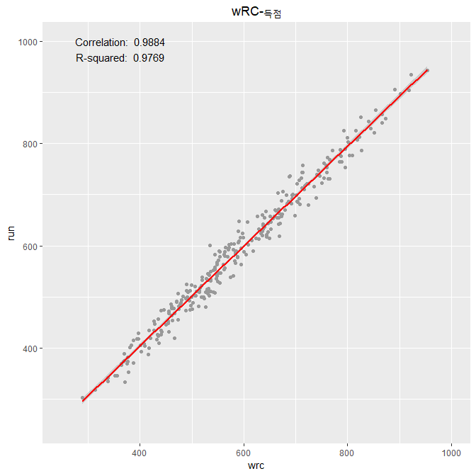

그래프 한 눈에 보기
===================

``` r
gridExtra::grid.arrange(graph1, graph2, graph3, graph4, graph5, graph6, ncol = 2)
```

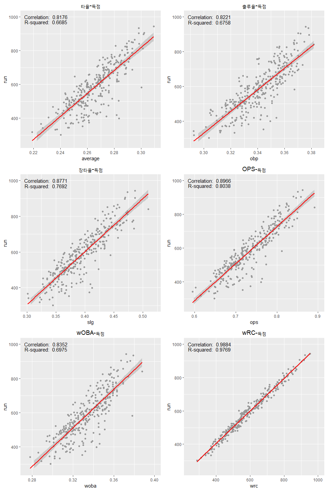
